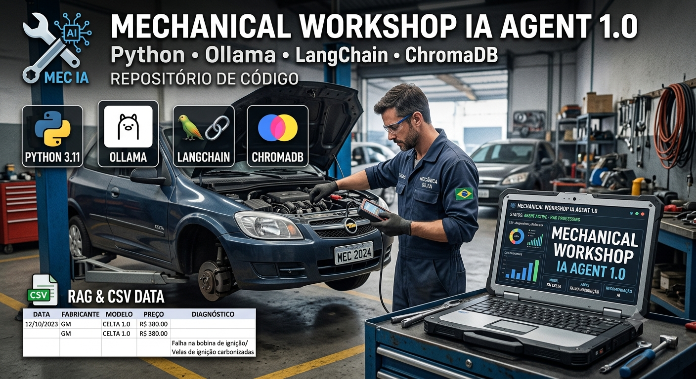
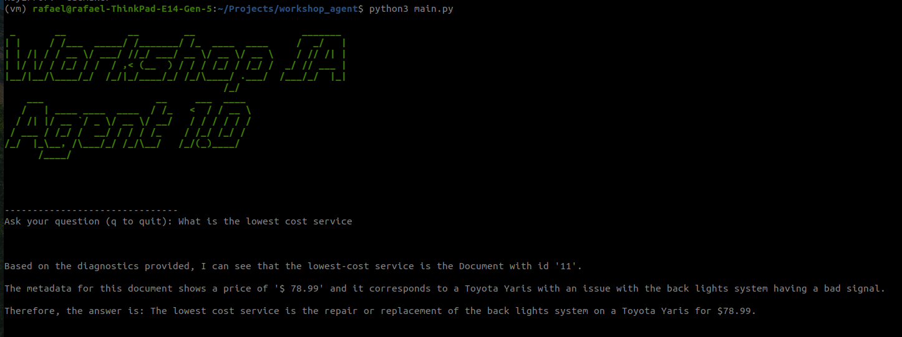

# Mechanical Workshop IA Agent 1.0

This is an Mechanical workshop diagnostic history system. It can be used do aim in future services. Based on the history, mechanicals can estimate another problems diagnostics and price.

That IA Agent helps user to get some knowlogement about the historical data. User can insert they question, and system the system will give the IA answer, for exemple, "What is the most commom problem in GM Celta".

This project is based on RAG concept, so IA models can receive files and information that can give to the model all the business domain context, so answer is acurated, not a simple model hallucination.

In this approach, a CSV file with historical diagnostic data is inserted into a vectorial database. The stored data is used by IA model to get context.

# Core Technologies

This project uses:
- Retrieval-Augmented Generation(RAG)
- Python 3.10
- LangChain
- ChromaDB
- Ollama
- Docker
- Pandas
- IA Model mxbai-embed-large
- IA Model llama3.2

This was made during study period crossing multiples web tutorials.

# Get Start 

1 - Fisrt, execute Ollama with docker.\
`sudo docker run -d --device /dev/kfd --device /dev/dri -v ollama:/root/.ollama -p 11434:11434 --name ollama ollama/ollama:rocm`\
<strong>PS: if you're not using AMD Radeon Grapichs video card, remove `:rocm` from command line.</strong>

2 - So, activate the virtual envirioment\
`. vm/bin/activate`

3 - then run the python main file\
`python main.py` or `python3 main.py`

